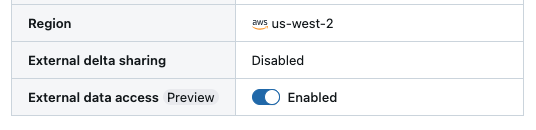
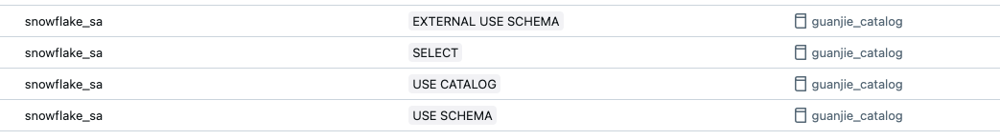

# Databricks to Snowflake Table Mirroring
[](https://pypi.org/project/databricks-uniform-sync/)
[](https://pepy.tech/project/databricks-uniform-sync)
[](https://github.com/guanjieshen/databricks-uniform-sync/actions?query=workflow%3Abuild)
[](https://opensource.org/licenses/MIT)


This repository provides a utility to **synchronize (mirror) Iceberg table metadata** from **Databricks Unity Catalog** to **Snowflake Horizon**.

It automates the creation of the following assets in Snowflake:
- Catalog Integrations (using Credential Vending)
- External Iceberg Tables

> Note: As this library uses **credential vending** to access cloud storage. Snowflake External Volumes are **not** required.

---

## Table of Contents

1. [Overview](#overview)
2. [Snowflake Setup](#snowflake-setup)
3. [Databricks Setup](#databricks-setup)
4. [How to Use](#how-to-use)
5. [Configuration](#configuration)
6. [Parameter Reference](#parameter-reference)
7. [Example Usage](#example-usage)
8. [Limitations](#limitations)

---

## Overview

This utility automates the following tasks:

- Retrieves Iceberg metadata from Unity Catalog  
- Generates Delta-based metadata tables in Databricks  
- Creates Catalog Integrations in Snowflake  
- Creates External Iceberg Tables in Snowflake  

---

## Snowflake Setup

This library supports two usage patterns:

- Manual: Generate DDLs for manual execution in Snowflake
- Automated: Create Snowflake assets directly from Databricks

In order to use the _automated_ approach, configure a Snowflake Service Account using __[key-pair authentication](https://docs.snowflake.com/en/user-guide/key-pair-auth)__.

>Make sure the private RSA key is saved, as the library will need this to connect to Snowflake.

For example, in Snowflake:

```sql
CREATE USER databricks_service_account
CREATE USER databricks_service_account
  COMMENT = 'Service account for Databricks using RSA key-pair authentication'
  DEFAULT_ROLE = ACCOUNTADMIN
  DEFAULT_WAREHOUSE = <YOUR_DEFAULT_WAREHOUSE>
  RSA_PUBLIC_KEY = <RSA_PUBLIC_KEY>
```
Ensure the Snowflake Role assigned to the service account has the following Snowflake privileges:

- Create Catalog Integrations
- Create External Iceberg Tables
- [Optional] Create Database 
- [Optional] Create Schema 

---


## Databricks Setup 

The following configurations are required regardless of which usage pattern (manual or automated) is leveraged.

##### Unity Catalog Metastore Configuration
In order to support external engines, you will need to __[enable external data access to Unity Catalog](https://docs.databricks.com/aws/en/external-access/admin)__




##### Service Principal Configuration
In order to configure the Snowflake Catalog Integration, a __[Databricks Service Principal](https://docs.databricks.com/aws/en/admin/users-groups/service-principals#add-a-service-principal-to-a-workspace-using-the-workspace-admin-settings)__ is required for Snowflake to authenticate to the Unity Catalog APIs.

>Make sure the client id and client secret are saved, as the library will need this to connect to create the catalog integration.

 Using the Service Principal created above, add the following permissions for the Service Principal to any catalogs that will need to be syncronized to Snowflake Horizon.

- EXTERNAL USE SCHEMA
- SELECT
- USE CATALOG
- USE SCHEMA



---

## How to Use

Install the library:

```bash
pip install databricks_uniform_sync
```

Initialize the class:

```python
from databricks_uniform_sync import DatabricksToSnowflakeMirror

d2s = DatabricksToSnowflakeMirror(
    spark_session=spark,
    dbx_workspace_url="https://dbcxyz.databricks.cloud.net",
    dbx_workspace_pat="dapi...",
    metadata_catalog="dbx_sf_mirror_catalog",
    metadata_schema="dbx_sf_mirror_schema"
)
```

### 1. Create or Refresh Metadata Tables

```python
d2s.create_metadata_tables()
d2s.refresh_metadata_tables(catalog="your_catalog")
```

These methods are idempotent and safe to rerun.  
If metadata tables do not exist, `refresh_metadata_tables()` will create them.

---

### 2. Add Unity Catalog Discovery Tags

```python
d2s.refresh_uc_metadata_tags()
```

These tags are used to determine sync eligibility. Do not remove them.

---

### 3. Create Snowflake Catalog Integrations

Dry run (SQL only):

```python
d2s.generate_create_sf_catalog_integrations_sql(
    oauth_client_id="client-id",
    oauth_client_secret="client-secret"
)
```

Execute directly:

```python
d2s.create_sf_catalog_integrations(
    sf_account_id="xyz-123",
    sf_user="svc_name",
    sf_private_key_file="rsa/rsa_key.p8",
    sf_private_key_file_pwd="your-password",
    oauth_client_id="client-id",
    oauth_client_secret="client-secret"
)
```

---

### 4. Create Iceberg Tables in Snowflake

Dry run:

```python
d2s.generate_create_sf_iceberg_tables_sql()
```

Execute directly:

```python
d2s.create_sf_iceberg_tables_sql(
    sf_account_id="xyz-123",
    sf_user="svc_name",
    sf_private_key_file="rsa/rsa_key.p8",
    sf_private_key_file_pwd="your-password"
)
```

---

## Configuration

### Custom Metadata Table Name

```python
d2s = DatabricksToSnowflakeMirror(
    spark_session,
    dbx_workspace_url,
    dbx_workspace_pat,
    metadata_catalog,
    metadata_schema,
    metadata_table_name="custom_table_name"
)
```

A corresponding view will also be created with a `_vw` suffix.

---

### Custom Refresh Interval

```python
d2s.create_sf_catalog_integrations(
    ...,
    refresh_interval_seconds=120
)
```

---

### Disable Auto-Refresh on Iceberg Tables

```python
d2s.create_sf_iceberg_tables_sql(
    ...,
    auto_refresh=False
)
```

---

## Parameter Reference

### Databricks Parameters

| Parameter | Description |
|-----------|-------------|
| `spark_session` | Active SparkSession in Databricks |
| `dbx_workspace_url` | URL of your Databricks workspace |
| `dbx_workspace_pat` | Personal Access Token for authentication |
| `metadata_catalog` | Unity Catalog catalog to store metadata |
| `metadata_schema` | Unity Catalog schema to store metadata |
| `metadata_table_name` (optional) | Custom name for metadata table |

### Snowflake Parameters

| Parameter | Description |
|-----------|-------------|
| `sf_account_id` | Snowflake account identifier |
| `sf_user` | Snowflake user/service account |
| `sf_private_key_file` | Path to RSA private key |
| `sf_private_key_file_pwd` | Password to decrypt RSA key |
| `oauth_client_id` | Databricks OAuth client ID |
| `oauth_client_secret` | Databricks OAuth client secret |
| `refresh_interval_seconds` (optional) | Catalog Integration refresh interval |
| `auto_refresh` (optional) | Enable/disable automatic refresh on tables |

---

## Example Usage

Here's an [example notebook](https://github.com/guanjieshen/databricks-uniform-sync/blob/main/example_notebook.ipynb) on how how to use this library

---

## Limitations

- Only supports Iceberg tables on S3  
- Deleting tables in Unity Catalog does not remove them in Snowflake  
- Only supports RSA key pair authentication (Snowflake MFA compliance)

---
