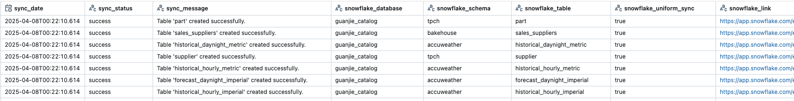
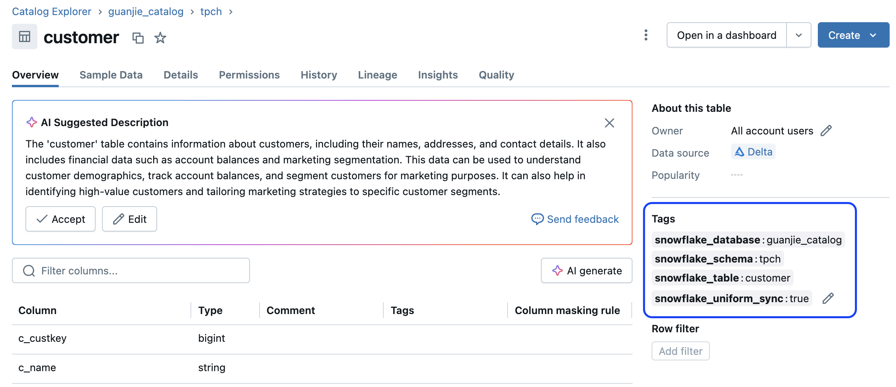

# Databricks to Snowflake Table Mirroring
[](https://pypi.org/project/databricks-uniform-sync/)
[](https://pepy.tech/project/databricks-uniform-sync)
[](https://github.com/guanjieshen/databricks-uniform-sync/actions?query=workflow%3Abuild)
[](https://opensource.org/licenses/MIT)


This repository provides a utility to **synchronize (mirror) Iceberg table metadata** from **Databricks Unity Catalog** to **Snowflake Horizon**.

It automates the creation of the following assets in Snowflake:
- Catalog Integrations (using Credential Vending)
- External Iceberg Tables

> Note: As this library uses **credential vending** to access cloud storage. Snowflake External Volumes are not required.

---

## Table of Contents

1. [Overview](#overview)
2. [Snowflake Setup](#snowflake-setup)
3. [Databricks Setup](#databricks-setup)
4. [How to Use](#how-to-use)
5. [Configuration](#configuration)
6. [Parameter Reference](#parameter-reference)
7. [Metadata Columns](#metadata-columns)
8. [Example Usage](#example-usage)
9. [Limitations](#limitations)

---

## Overview

This utility automates the following tasks:

- Retrieves Iceberg metadata from Unity Catalog  
- Generates Delta-based metadata tables in Databricks  
- Creates Catalog Integrations in Snowflake  
- Creates External Iceberg Tables in Snowflake  

The metadata tables will contain information on what assets in Snowflake have been created, and provide a status on the syncronization state.


---

## Snowflake Setup

This library supports two usage patterns:

- Manual: Generate DDLs for manual execution in Snowflake
- Automated: Create Snowflake assets directly from Databricks

In order to use the _automated_ approach, configure a Snowflake Service Account using __[key-pair authentication](https://docs.snowflake.com/en/user-guide/key-pair-auth)__.

>Make sure the private RSA key is saved, as the library will need this to connect to Snowflake.

For example, in Snowflake:

```sql
CREATE USER databricks_service_account
CREATE USER databricks_service_account
  COMMENT = 'Service account for Databricks using RSA key-pair authentication'
  DEFAULT_ROLE = ACCOUNTADMIN
  DEFAULT_WAREHOUSE = <YOUR_DEFAULT_WAREHOUSE>
  RSA_PUBLIC_KEY = <RSA_PUBLIC_KEY>
```
Ensure the Snowflake Role assigned to the service account has the following privileges:

- Create Catalog Integrations
- Create External Iceberg Tables
- Create Database 
- Create Schema 

---


## Databricks Setup 

The following configurations are required regardless of which usage pattern (manual or automated) is leveraged.

##### Unity Catalog Metastore Configuration
In order to support external engines, you will need to __[enable external data access to Unity Catalog](https://docs.databricks.com/aws/en/external-access/admin)__


##### Service Principal Configuration
In order to configure the Snowflake Catalog Integration, a __[Databricks Service Principal](https://docs.databricks.com/aws/en/admin/users-groups/service-principals#add-a-service-principal-to-a-workspace-using-the-workspace-admin-settings)__ is required for Snowflake to authenticate to the Unity Catalog APIs.

>Make sure the client id and client secret are saved, as the library will need this to connect to create the catalog integration.

 Using the Service Principal created above, add the following permissions for the Service Principal to any catalogs that will need to be synchronized to Snowflake Horizon.

- EXTERNAL USE SCHEMA
- SELECT
- USE CATALOG
- USE SCHEMA


---

## How to Use

Install the library:

```bash
pip install databricks_uniform_sync
```

Initialize the class:

```python
from databricks_uniform_sync import DatabricksToSnowflakeMirror

d2s = DatabricksToSnowflakeMirror(
    spark_session=spark,
    dbx_workspace_url="https://dbcxyz.databricks.cloud.net",
    dbx_workspace_pat="dapi...",
    metadata_catalog="dbx_sf_mirror_catalog",
    metadata_schema="dbx_sf_mirror_schema"
)
```

_Ensure that the metadata catalog and metadata schema already exist within Unity Catalog._

### 1. Create or Refresh Metadata Tables
The following  command will create the metadata table and view in the location specified in `DatabricksToSnowflakeMirror`.

```python
d2s.create_metadata_tables()
```
The following command will automatically locate Iceberg compatible tables within `your_catalog`.
```python
d2s.refresh_metadata_tables(catalog="your_catalog")
```

If metadata tables do not exist, `refresh_metadata_tables()` will create them.


> 💡 **Tip**: These methods are idempotent and are safe to rerun.
---
### 2. Check the Metadata View
You can validate the comaptible tables by querying the metadata view:

```sql
SELECT * FROM dbx_sf_mirror_catalog.dbx_sf_mirror_schema.dbx_sf_uniform_metadata_vw;
```


---

### 3. Add Unity Catalog Discovery Tags

This command will automatically add Unity Catalog discovery tags to all of the tables identified in Step 1.

```python
d2s.refresh_uc_metadata_tags()
```

> ⚠️ **Warning**: These tags are used to determine sync eligibility. Do not remove them. 

---

### 4. Update Unity Catalog Discovery Tags

Four discovery tags are automatically created for each table. These can be used to apply a custom mapping to Snowflake. 

- __snowflake_database:__ Mirrored Snowflake database name
- __snowflake_schema:__ Mirrored Snowflake schema name
- __snowflake_table:__ Mirrored Snowflake table name
- __snowflake_uniform_sync:__ `true` or `false` 




SQL can also be used to perform updates to the tags:

```sql
ALTER TABLE your_catalog.your_schema.your_table
SET TAGS ('snowflake_uniform_sync' = 'false');
```

---


### 5. Create Snowflake Catalog Integrations

Dry run (SQL only):

```python
d2s.generate_create_sf_catalog_integrations_sql(
    oauth_client_id="client-id",
    oauth_client_secret="client-secret"
)
```

Create catalog integrations within Snowflake:

```python
d2s.create_sf_catalog_integrations(
    sf_account_id="xyz-123",
    sf_user="svc_name",
    sf_private_key_file="rsa/rsa_key.p8",
    sf_private_key_file_pwd="your-password",
    oauth_client_id="client-id",
    oauth_client_secret="client-secret"
)
```
⚠️ Warning: Do not cancel the `create_sf_catalog_integrations` mid-exeuction.


---

### 4. Create Iceberg Tables in Snowflake

Dry run (SQL generation only):

```python
d2s.generate_create_sf_iceberg_tables_sql()
```

Create iceberg tables within Snowflake:

```python
d2s.create_sf_iceberg_tables(
    sf_account_id="xyz-123",
    sf_user="svc_name",
    sf_private_key_file="rsa/rsa_key.p8",
    sf_private_key_file_pwd="your-password"
)
```
⚠️ **Warning**: If  `create_sf_iceberg_tables` is cancelled mid-execution, the metadata table will not update with the status of the sync.

---

## Configuration

### Custom Metadata Table & View Name

```python
d2s = DatabricksToSnowflakeMirror(
    spark_session,
    dbx_workspace_url,
    dbx_workspace_pat,
    metadata_catalog,
    metadata_schema,
    metadata_table_name="custom_table_name"
)
```

A corresponding view will also be created with a `_vw` suffix.

---

### Custom Refresh Interval

```python
d2s.create_sf_catalog_integrations(
    ...,
    refresh_interval_seconds=120
)
```

---

### Disable Auto-Refresh on Iceberg Tables

```python
d2s.create_sf_iceberg_tables_sql(
    ...,
    auto_refresh=False
)
```

---

## Parameter Reference

### Databricks Parameters

| Parameter | Description |
|-----------|-------------|
| `spark_session` | Active SparkSession in Databricks |
| `dbx_workspace_url` | URL of your Databricks workspace |
| `dbx_workspace_pat` | Personal Access Token for authentication |
| `metadata_catalog` | Unity Catalog catalog to store metadata |
| `metadata_schema` | Unity Catalog schema to store metadata |
| `metadata_table_name` (optional) | Custom name for metadata table |

### Snowflake Parameters

| Parameter | Description |
|-----------|-------------|
| `sf_account_id` | Snowflake account identifier |
| `sf_user` | Snowflake user/service account |
| `sf_private_key_file` | Path to RSA private key |
| `sf_private_key_file_pwd` | Password to decrypt RSA key |
| `oauth_client_id` | Databricks Service Principal client ID |
| `oauth_client_secret` | Databricks Service Principal secret |
| `refresh_interval_seconds` (optional) | Catalog Integration refresh interval |
| `auto_refresh` (optional) | Enable/disable automatic refresh on tables |

---
## Metadata View Columns 

| Column                          | Description                                                  |
|----------------------------------|--------------------------------------------------------------|
| `dbx_sf_uniform_metadata_id`     | Unique identifier for the metadata record (BIGINT)           |
| `uc_catalog_id`                  | ID of the Unity Catalog catalog (STRING)                     |
| `uc_catalog_name`                | Name of the Unity Catalog catalog (STRING)                   |
| `uc_schema_id`                   | ID of the Unity Catalog schema (STRING)                      |
| `uc_schema_name`                 | Name of the Unity Catalog schema (STRING)                    |
| `uc_table_id`                    | ID of the Unity Catalog table (STRING)                       |
| `uc_table_name`                  | Name of the Unity Catalog table (STRING)                     |
| `table_location`                 | Storage location of the table (STRING)                       |
| `table_type`                     | Type of the table (e.g., MANAGED, EXTERNAL) (STRING)         |
| `snowflake_catalog_integration` | Name of the Snowflake catalog integration (STRING)           |
| `snowflake_account_id`          | Account identifier for the Snowflake instance (STRING)       |
| `sync_date`                      | Timestamp of the last synchronization attempt (TIMESTAMP)    |
| `sync_status`                    | Status of the sync (e.g., SUCCESS, FAILED) (STRING)          |
| `sync_message`                   | Additional message or error detail about sync (STRING)       |
| `snowflake_database`            | Target Snowflake database name (STRING)                      |
| `snowflake_schema`              | Target Snowflake schema name (STRING)                        |
| `snowflake_table`               | Target Snowflake table name (STRING)                         |
| `snowflake_uniform_sync`        | Indicates if uniform sync is enabled (e.g., TRUE/FALSE)      |
| `snowflake_link`                | URL or identifier linking to the Snowflake table (STRING)    |

---
## Example Usage

Here's an [example notebook](https://github.com/guanjieshen/databricks-uniform-sync/blob/main/example_notebook.ipynb) on how how to use this library

---

## Limitations

- Only supports Iceberg tables on S3  
- Does not support synchronizing deletes between UC and Snowflake.
- Only supports RSA key pair authentication (Snowflake MFA compliance)

---
